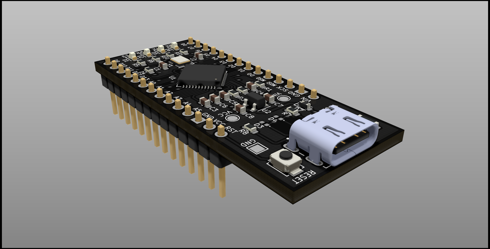
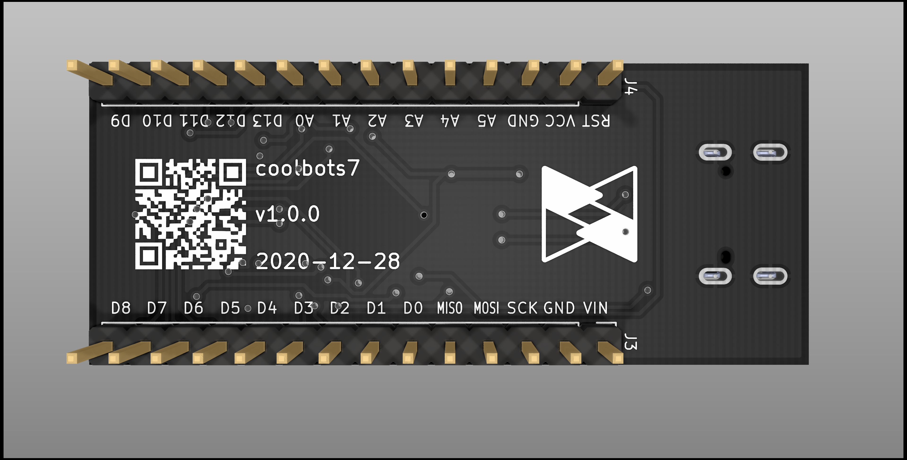
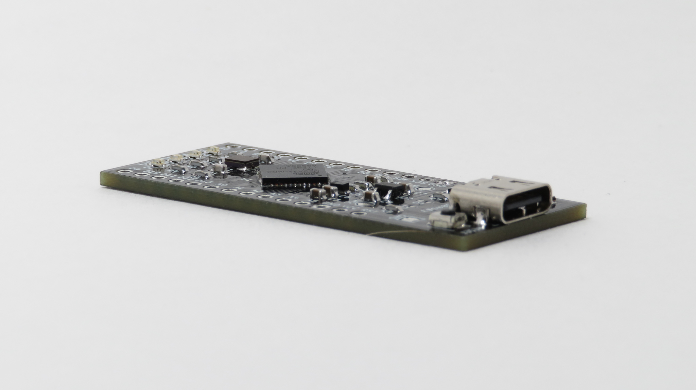

# Development Boards
PCBs made to test core designs and / or help with rapid prototyping.

# Boards
## ATMega32u4 Development Board (Arduino Micro Equivalent)
Breadboard breakout PCB for an ATMega32u4 8-bit AVR microcontroller.

 
 
 

### Features:
* USB-C connector for programming and power up to 250mA.
* 5V 500mA linear regulator for external power up to 12VDC.
* Power, TX, RX, and D13 LEDs.
* Pins are labeled on both the top and bottom of the board for easy reference.
  * Note: The pinout is not the same as an actual Arduino Micro

### Bill of Materials:
[Shopping Cart on DigiKey](https://www.digikey.com/short/4ch5mv)

### Future Ideas:
* Ability to construct 3.3V and 5V versions using the same PCB